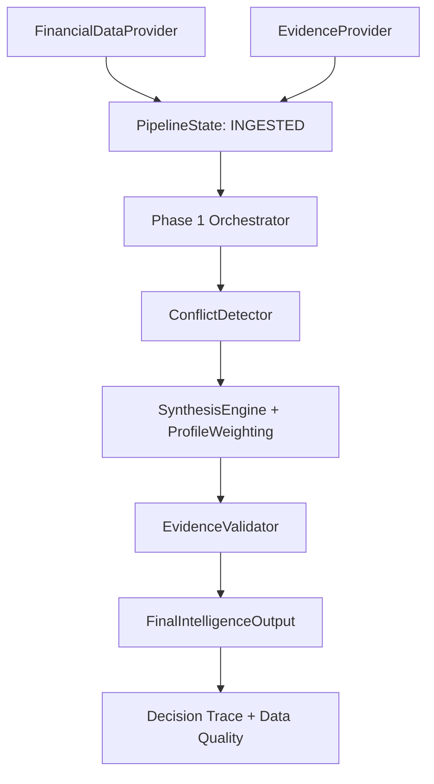

# Phase 3: Integration, Evidence, State, and Deployment

## Objective and architecture

Phase 3 connects the existing specialist agents and personalized synthesis engine into a failure-tolerant end-to-end service. The API remains unchanged; an API owner can call `await IntelligencePipeline().run(symbol, user_profile)`.

```text
Phase 1
Multi-Agent Core
      ↓
Phase 2
Personalized Decision Engine
      ↓
Phase 3
Integration + Evidence + Deployment
```



## Data ingestion and providers

`FinancialDataProvider` is an abstract boundary. `MockFinancialDataProvider` supplies deterministic `DEMO` context without credentials. Future real providers can implement the same interface without changes to agents, conflict handling, weighting, or synthesis. `EvidenceProvider` follows the same pattern, and mock evidence is explicitly labeled as demonstration evidence rather than a real citation.

## Persistent state and orchestration

Each run receives a UUID `run_id`. The existing `PipelineState` is extended rather than duplicated and records context, profile, agent outputs, conflicts, weights, synthesis, evidence, trace, errors, timestamps, and lifecycle status. The high-level pipeline progresses through ingestion, analysis, synthesis, validation, and completion. Partial results and errors are retained in the in-memory state registry for the process lifetime.

## Failure handling and data quality

Provider failures return a structured degraded result. Failed or degraded agents are excluded by the Phase 2 synthesis engine and are never fabricated. Evidence-provider failure allows synthesis to continue, reduces confidence, marks evidence quality as degraded, and adds a data-quality trace entry. Market, agent-coverage, and evidence quality are exposed as `GOOD`, `PARTIAL`, `DEGRADED`, or `UNAVAILABLE`.

## Explainability and safety

The final output preserves specialist evidence and concise auditable trace steps for agent signals, conflicts, profile, weighting, synthesis, data quality, and final assessment. It does not expose private chain-of-thought, place trades, or claim guaranteed returns. The result is investment intelligence and decision support.

## Deployment

The existing Dockerfile starts FastAPI with Uvicorn and requires no external credentials for the mock pipeline. Configure future services through `.env`; do not commit secrets. Build with `docker build -t financial-intelligence .` from the `backend` directory.

## Hackathon judging summary

> The system combines independent financial reasoning agents with a profile-aware synthesis layer and an auditable integration pipeline. Financial and evidence data are ingested into persistent pipeline state, analyzed concurrently by specialized agents, reconciled when signals conflict, and synthesized according to the investor's risk profile. Every final assessment retains supporting evidence, data-quality information, and a concise decision trace. The architecture is modular, failure-tolerant, and containerized for rapid deployment.
